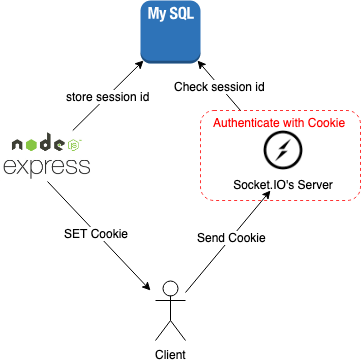

# express-session-resolver
This module makes you to get session-id from the cookie which the id is generated by express-session.

### Requirement
 - using [express-session](https://github.com/expressjs/session)
 - stored the session MySQL Server by [express-mysql-session](https://github.com/chill117/express-mysql-session)

### Usecase
Suppose that they have 2 same domain's servers, Socket IO's sever is able to authenticate reauests the by cookie which is generated from the express server. express-session-resolver convert cookie to session-id, and queries to MySQL server.   


### How to use
```shell
npm install express-session-resolver
```

then,
```js
const Resolver = require('express-session-resolver');
const resolver = new Resolver({
    mysql: {
        host: "your my sql server's host",
        port: "the port",
        user: "the user",
        password: "the password",
        database: "the database name"
    },
    name: "cookie name", 
    secret: "secret"
});

// --------------------------------
// For example, Socket IO's server
// At 1st, you can use middleware for auth. 
const authMiddleware = function() {

    return async function(socket, next) {
        
        const noCookies = !socket.handshake.headers || !socket.handshake.headers.cookie

        if (noCookies) {
            next(new Error('Auth error'))
            return
        }

        const session = await resolver
            .findSession(socket.handshake.headers.cookie)
            .catch(()=>null)

        if (session) {
            next()
        } else {
            next(new Error('Auth error (not match)'))
        }
    }
}
// add it as a middleware 
io.use(authMiddleware())

// --------------------------------
// For example, express server
app.get("/secret-page", function(req, res, next){
    resolver.findSession(req.headers.cookie)
    .then(result=>{
        res.send(result[0].session_id);
    })
})
```